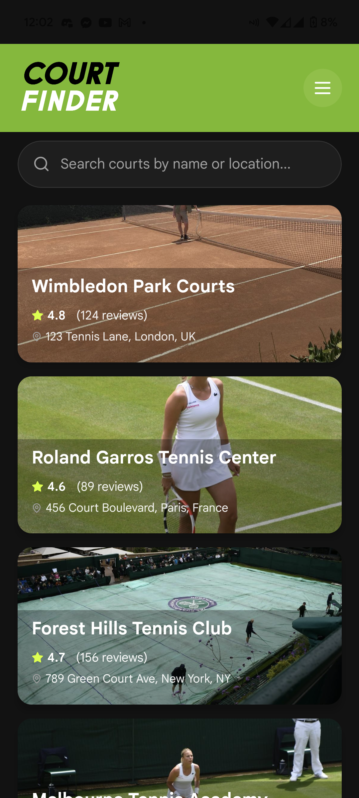

<div align="center">
  
  
  # Tennis Court Reviewer
  
  A delightful mobile-first application for reviewing tennis courts
  
  
  
</div>

## About

**Tennis Court Reviewer** is a React Native mobile application built with Expo and TypeScript. It provides a beautiful, user-friendly interface for discovering and reviewing tennis courts around the world.

The app demonstrates modern mobile development practices including infinite scroll pagination, optimistic UI updates, and a scalable architecture that can handle large datasets (51+ courts).

## Key Features

- 🎾 **Court Finder**: Browse through 51+ tennis courts with beautiful image cards
- 🔍 **Smart Search**: Real-time search by court name or location
- ⭐ **Reviews System**: View ratings and leave your own reviews with comments
- 📱 **Infinite Scroll**: Efficient pagination that loads 10 courts at a time
- 🎨 **Beautiful Design**: Tennis-themed color palette with smooth animations
- 🖼️ **High-Quality Images**: Local court photos and professional placeholders

## How It Works

The application uses a client-side architecture with the following key components:

### Data Management
- **Mock Data**: All court data is stored locally in TypeScript files
- **51+ Courts**: Comprehensive dataset with varied locations worldwide
- **Optimistic Updates**: Reviews appear immediately before server confirmation (simulated)

### Performance Optimization
- **Infinite Scroll**: Initial load shows 10 items, automatically loads more as you scroll
- **Lazy Loading**: Images load on-demand for better performance
- **FlatList**: Uses React Native's optimized list component for smooth scrolling

### User Experience
- **Search**: Real-time filtering as you type
- **Smooth Animations**: Press animations on cards and buttons
- **Accessible**: Touch targets meet 44px minimum for accessibility
- **Responsive**: Optimized for mobile devices with proper safe area handling

## Tech Stack

- **Framework**: React Native (Expo SDK 51)
- **Language**: TypeScript
- **Navigation**: Expo Router (file-based routing)
- **Icons**: Lucide React Native
- **Styling**: React Native StyleSheet
- **Platform**: iOS & Android

## Project Structure

```
code-challenges/
├── frontend-challenge/          # Main application
│   ├── app/                     # Expo Router pages
│   │   ├── _layout.tsx         # Root layout
│   │   ├── index.tsx           # Home screen (Court Finder)
│   │   └── [id].tsx            # Detail screen (Court Insight)
│   ├── data/                    # Mock data
│   │   └── courts.ts           # 51+ courts with reviews
│   ├── assets/                  # Images and logos
│   │   └── images/
│   │       ├── logo/           # App logos
│   │       └── *.jpg           # Court images
│   ├── types/                   # TypeScript definitions
│   ├── constants/               # App constants (colors, etc.)
│   └── package.json
└── README.md                    # This file
```

## Getting Started

Navigate to the `frontend-challenge` directory for setup instructions:

```bash
cd frontend-challenge
```

See [frontend-challenge/README.md](./frontend-challenge/README.md) for detailed installation and running instructions.

## Design Philosophy

The app follows a "delightful" design philosophy:

- **Tennis Theme**: Color palette inspired by tennis courts (Deep Forest Green, Court Blue, Lime Accent)
- **Smooth Interactions**: Press animations and transitions
- **Visual Hierarchy**: Clear information architecture with cards and overlays
- **Accessibility**: Large touch targets and readable text sizes
- **Performance**: Optimized for smooth scrolling with large datasets

## Screenshots

The app includes two main screens:

1. **Court Finder (Home)**: List view with search, showing court cards with images, ratings, and locations
2. **Court Detail**: Detailed view with hero image, amenities, reviews, and ability to add new reviews

## License

This project was created as a code challenge demonstration.

