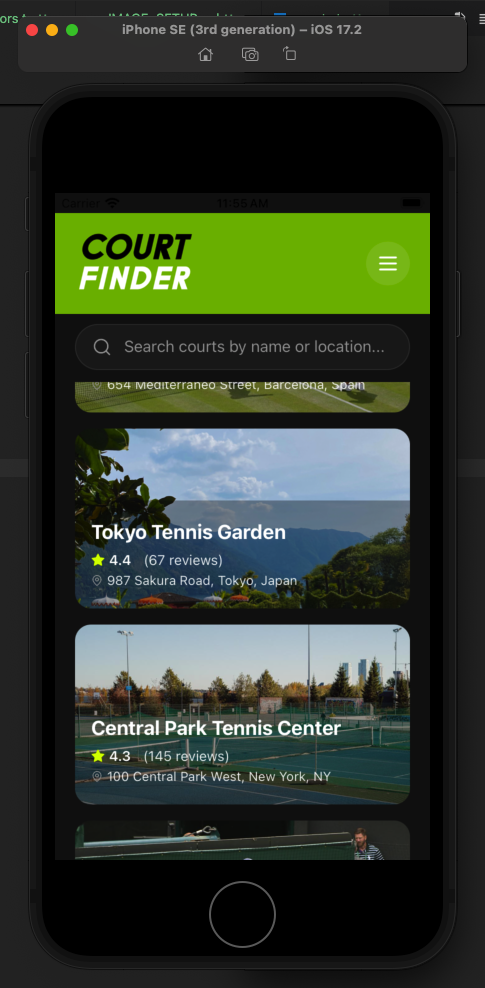

<div align="center">
  
</div>

# Tennis Court Reviewer - React Native App

A delightful mobile-first application for reviewing tennis courts, built with React Native (Expo) and TypeScript.

<div align="center">
  
</div>

## Features

- **Court Finder**: Browse and search through tennis courts
- **Court Details**: View detailed information, amenities, and reviews
- **Add Reviews**: Leave your own reviews with ratings and comments
- **Beautiful UI**: Tennis-themed design with smooth animations

## Getting Started

### Prerequisites

- Node.js (v16 or higher)
- npm or yarn
- Expo CLI (installed globally or via npx)

### Installation

1. Install dependencies:
```bash
npm install
```

2. Start the Expo development server:
```bash
npm start
```

3. Run on your preferred platform:
   - Press `i` for iOS simulator
   - Press `a` for Android emulator
   - Scan QR code with Expo Go app on your device

## Project Structure

```
frontend-challenge/
├── app/                # Expo Router pages
│   ├── _layout.tsx     # Root layout
│   ├── index.tsx       # Home screen (Court Finder)
│   └── [id].tsx        # Detail screen (Court Insight)
├── data/               # Mock data
│   └── courts.ts       # Court data with reviews
├── types/              # TypeScript types
│   └── index.ts        # Court and Review interfaces
├── constants/          # App constants
│   └── colors.ts       # Color palette
└── package.json        # Dependencies
```

## Design

- **Color Palette**: Deep Forest Green (#2C5F2D), Court Blue (#0066CC), Lime Accent (#CCFF00)
- **Touch Targets**: Minimum 44px for accessibility
- **Animations**: Smooth press animations on interactive elements

## Tech Stack

- React Native (Expo)
- TypeScript
- Expo Router (file-based routing)
- Lucide React Native (icons)
- React Native StyleSheet (styling)

## How It Works

The app uses **infinite scroll** pagination to efficiently handle large datasets (51+ courts). Here's how it works:

1. **Initial Load**: Displays 10 courts on first load for optimal performance
2. **Infinite Scroll**: Automatically loads the next 10 courts as the user scrolls near the bottom
3. **Search**: Real-time filtering by court name or location
4. **Optimistic UI**: Reviews are added immediately with local state updates
5. **Client-Side Pagination**: All data is stored locally and paginated on the client side

## Notes

- All data is mocked locally (51+ tennis courts)
- Reviews are stored in component state (optimistic UI updates)
- Court images use local assets (first 9 courts) and placeholders (remaining courts)
- App supports both iOS and Android platforms
